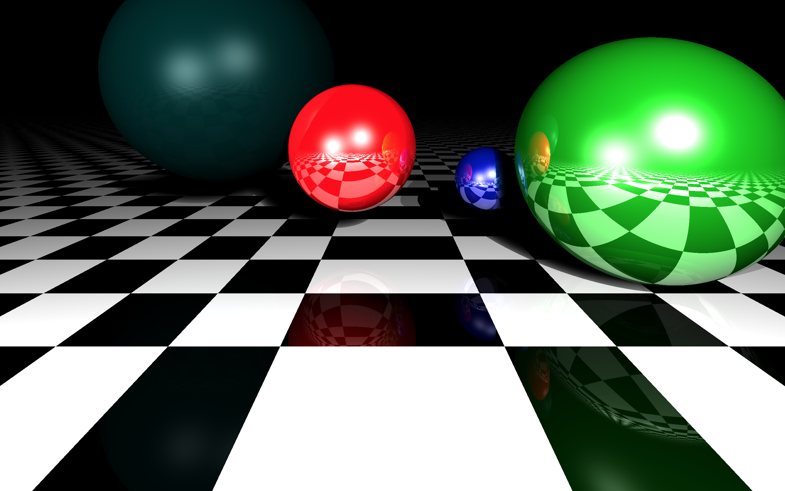

# Ray Tracer (Static)

A compact, pure-Python ray tracer that renders a static 2D image of a 3D scene. The project is refactored into a clean package layout with tests and CI/CD workflows so it can be showcased as a production-ready portfolio piece.



## Features

- Pure Python implementation (no external runtime dependencies)
- Blinn-Phong shading with ambient, diffuse, and specular components
- Recursive reflections
- Soft shadow approximation
- Deterministic PPM output

## Quickstart

```bash
python -m venv .venv
source .venv/bin/activate
pip install -e .[dev]

python -m ray_tracer --output render.ppm
```

The output is a standard ASCII PPM file. Most image viewers can open it directly, or you can convert it to PNG using your favorite tool.

## Development

```bash
pytest
ruff check src tests
```

## Docker

```bash
docker build -t ray-tracer .
docker run --rm -v \"$PWD\":/output ray-tracer --output /output/render.ppm
```

## CI/CD

- CI: Lint + tests on pushes and pull requests (`.github/workflows/ci.yml`).
- CD: Build artifacts on tagged releases and attach them to GitHub releases (`.github/workflows/release.yml`).

## Project Layout

```
.
|-- src/ray_tracer        # Core package
|-- tests                # Pytest suite
`-- res                  # Example renders
```

## License

See `LICENSE`.
