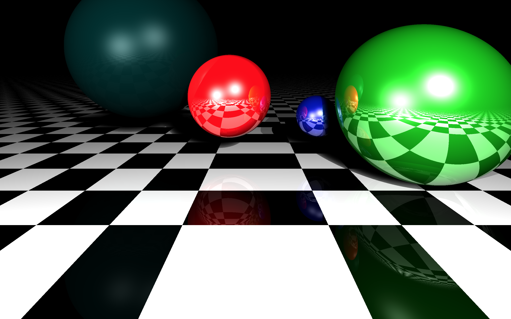

# Statisk Ray Tracing

## Översikt
En simpel statisk raytracer

En statisk raytracer renderar en 2d bild som ögat ser genom att man simulerar
en öga som står vid en punkt och kollar på ett 3d rum med en ljuskälla som lyser på olika objekt.

Den fungerar på det sättet att istället för att simulera alla ljusstrålar från en ljuskälla så
backtrackar man endast ljusstrålar som når ögat tillbaka till ljuskällan. I 3d rummet kan vi placera
ut sfärer och en ljuskälla och med hjälp av raytracern rendera hur rummet ser ut från en viss punkt.

||
|:--:| 
| *Figur1. Exempel på renderad scen.* |

## Documentation
Läs [Documentation.md](https://gits-15.sys.kth.se/grudat21/zeshen-ovn7/blob/master/Documentation.md) för dokumentationen. Den är för lång för att lägga till här.

### Roadmap

* API:et av biblioteket är frusen.
* Versionsnummer hänvisas till [Semantisk versionshantering][sv].

Den enda acceptabla anledningen att modifiera API:et av paketet 
är om man inte kan hantera problem på annat sätt.

Zeshen Bao – [zeshen](https://gits-15.sys.kth.se/zeshen)
2021 VT

[sv]: http://semver.org/
